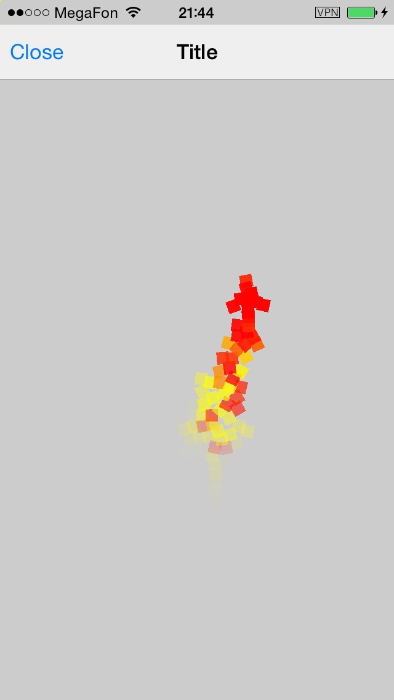
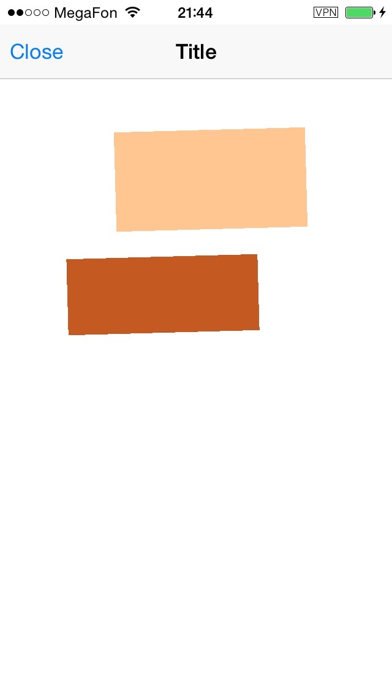
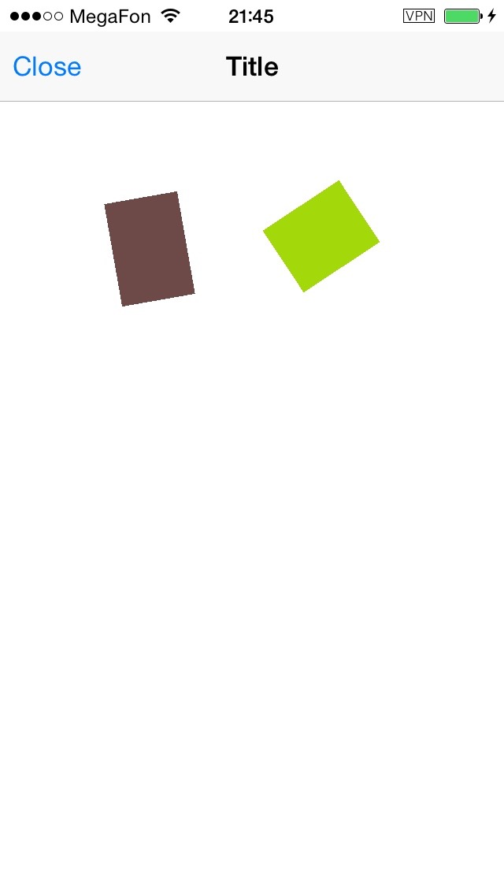

# UIKit-Dynamics-Sample

This is a sample of using UIDynamicBehavior classes

- UIGravityBehavior
- UIAttachmentBehavior
- UICollisionBehavior
- UIPushBehavior
- UISnapBehavior
- UIDynamicItemBehavior

      
